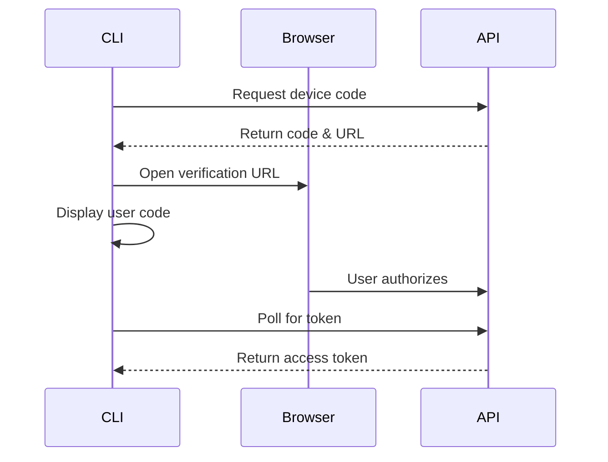

# Authentication Overview

Kanuni CLI supports two modern authentication methods, designed for different use cases:

## Authentication Methods

### 🌐 Browser Authentication (OAuth Device Flow)
**Best for**: Interactive use, personal development, maximum security

- Opens your browser for authentication
- Supports MFA and SSO
- No credentials stored locally
- Automatic token refresh
- Most secure option

### 🔑 API Keys
**Best for**: CI/CD, automation, scripts, server environments

- Long-lived credentials
- No browser required
- Perfect for automation
- Can be scoped with permissions
- Easy to revoke and rotate

## Quick Start

### Interactive Authentication

```bash
# Start the authentication flow
kanuni auth login

# You'll be prompted to choose:
# 1. Browser Authentication (Recommended)
# 2. API Key
```

### API Key Authentication

```bash
# Direct authentication with an API key
kanuni auth login --api-key kanuni_live_xxxxxxxxxxxx

# Or set as environment variable
export KANUNI_API_KEY=kanuni_live_xxxxxxxxxxxx
kanuni analyze document.pdf
```

## How It Works

### Browser Authentication Flow

1. **Initiate**: Run `kanuni auth login` and select "Browser Authentication"
2. **Device Code**: CLI displays a code like `ABCD-1234`
3. **Browser**: Your browser opens to `https://app.v-lawyer.ai/device`
4. **Authorize**: Log in and approve the device
5. **Complete**: CLI automatically receives the token



### API Key Flow

1. **Generate**: Create an API key in the web dashboard or CLI
2. **Store**: Save the key securely (shown only once)
3. **Use**: Provide the key via CLI flag or environment variable
4. **Authenticate**: Key is validated with each request

## Security Features

### Token Storage
- **Location**: `~/.config/kanuni/auth.json` (Linux/macOS) or `%APPDATA%\kanuni\auth.json` (Windows)
- **Permissions**: File permissions set to 600 (owner read/write only)
- **Encryption**: Tokens are stored in plain text but protected by file system permissions

### Token Refresh
- OAuth tokens automatically refresh when expired
- No manual intervention required
- Refresh tokens are rotated for security

### API Key Security
- Keys are shown only once at creation
- Stored as Argon2 hashes in the database
- Can be scoped with specific permissions
- Full audit trail of usage

## Authentication Commands

```bash
# Login interactively
kanuni auth login

# Login with API key
kanuni auth login --api-key <key>

# Check authentication status
kanuni auth status

# Create a new API key (requires authentication)
kanuni auth create-key

# List your API keys
kanuni auth list-keys

# Logout and clear credentials
kanuni auth logout
```

## Environment Variables

Kanuni respects the following environment variables:

```bash
# API key for authentication
export KANUNI_API_KEY=kanuni_live_xxxxxxxxxxxx

# API endpoint (for self-hosted or development)
export KANUNI_API_ENDPOINT=https://api.v-lawyer.ai

# Disable color output
export NO_COLOR=1

# Debug mode
export KANUNI_DEBUG=1
```

## Best Practices

### For Development
1. Use browser authentication for interactive work
2. Enable MFA for additional security
3. Review active sessions regularly

### For CI/CD
1. Create dedicated API keys for each environment
2. Store keys in secure secret management systems
3. Rotate keys periodically
4. Use read-only keys where possible

### For Teams
1. Each team member should have their own credentials
2. Use API keys for shared automation
3. Implement key rotation policies
4. Monitor key usage via audit logs

## Troubleshooting

### Authentication Failed

```bash
# Check your current authentication status
kanuni auth status

# Try logging in again
kanuni auth logout
kanuni auth login
```

### Token Expired

OAuth tokens refresh automatically. If you see token errors:

```bash
# Force a new login
kanuni auth login
```

### API Key Not Working

```bash
# Verify the key format (should start with kanuni_live_ or kanuni_test_)
echo $KANUNI_API_KEY

# Check if the key has expired or been revoked
kanuni auth list-keys
```

### Permission Denied

If you get file permission errors:

```bash
# Fix permissions on auth file
chmod 600 ~/.config/kanuni/auth.json
```

## Next Steps

- [Device Flow Authentication](./device-flow) - Detailed browser authentication guide
- [API Keys](./api-keys) - Complete API key management
- [CI/CD Setup](./ci-cd-setup) - Automation best practices